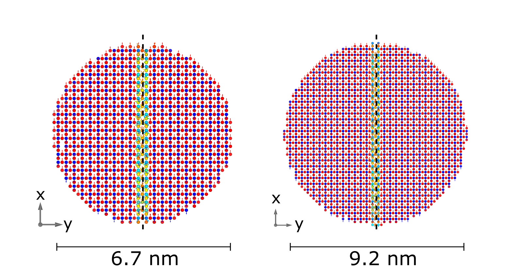

# MCS3P
Atomistic Monte Carlo simulation

*Simulated spin structures for particles of different sizes with an APB through the particle center. A field of 5T is applied along the x-direction. Full parallel and antiparallel alignment of spins are indicated with red and blue arrows, respectively. Clearly visible is the ferrimagnetic order that is disturbed by the APB as can be seen by the change of the colors.*

*Close-up view of the spin structure around the APB in the center. The view is along atomic columns in the z direction. A field of 5T is applied vertically along the x direction, thus full parallel and antiparallel alignment are shown in red and blue, respectively. Spin disorder is clearly visible around the APB but order is restored at larger distances from the APB. The inclusion of dipole-dipole interactions in the simulations has only a small influence onto the result.*
