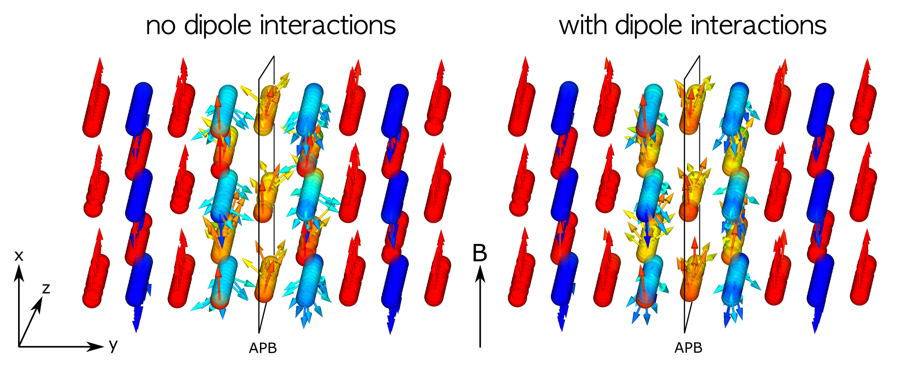

# MCS3P
Atomistic Monte Carlo simulation. 

With this program Monte Carlo simulations using the Metropolis algorithm can be performed in order to study the influence of antiphase boundaries on the spin structure of iron oxide nanoparticles. Antiphase boundaries (APBs) occur in many crystal structures and are commonly associated with metallic systems that exhibit disorder-oder transitions, such as the Cu_3Au alloy, [[1]](#1) (Fisher.1961, Wilson.1966, Warren.1990, Scardi.2005) but can exist in all ordered phases.~\cite{Kikuchi.1979} These kinds of defects have also been detected in $Fe_3O_4$-thin films and were the subject of numerous works.~\cite{Hibma.1999,Eerenstein.2001,Eerenstein.2002a,Eerenstein.2002b, Luysberg.2009, Gilks.2013, Moreno.2021} More recently it was recognized that APBs might be responsible in large parts for the anomalous magnetic properties of iron oxide nanoparticles.~\cite{Levy.2012,Disch.2012, Wetterskog.2013, Nedelkoski.2017, Koehler.2021}

*Simulated spin structures for particles of different sizes with an APB through the particle center. A field of 5T is applied along the x-direction. Full parallel and antiparallel alignment of spins are indicated with red and blue arrows, respectively. Clearly visible is the ferrimagnetic order that is disturbed by the APB as can be seen by the change of the colors.*

*Close-up view of the spin structure around the APB in the center. The view is along atomic columns in the z direction. A field of 5T is applied vertically along the x direction, thus full parallel and antiparallel alignment are shown in red and blue, respectively. Spin disorder is clearly visible around the APB but order is restored at larger distances from the APB. The inclusion of dipole-dipole interactions in the simulations has only a small influence onto the result.*

## References
<a id="1">[1]</a> 
Wilson, A. J. C. (1943)
The reflexion of {X}-rays from the ‘anti-phase nuclei’ of {A}u{C}u3}.
Proc. Math. Phys. Eng. Sci., 181(987), 360-368.
